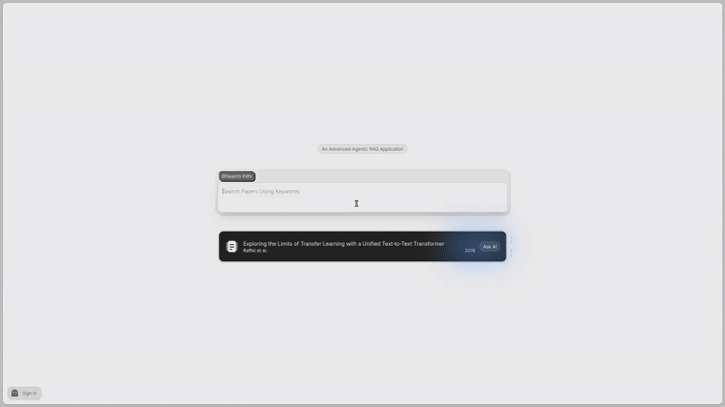

<div align="center"></div>

<div align="center">


</div>

# PaperRAG

<div align="center">
  
</div>

---

A Production grade full stack RAG application for answering queries related to online research papers

## Architecture
<div align="center">
  
</div>

---

**Query Router**
- Routes the query on the basis of requirement of context

**Query Enhancement Techniques**
- Use Step-back prompting to capture broad range of topics for enriched context
- Use Context aware query decomposition to generate a quality queries using retreived context from step-back prompt

**Advanced Retreival**
- Filter retreived documents to remove redundant and non-relevant documents
- Rerank the retreived documents using cross-encoder to get more relevance of ordering of documents

**Generation**
- Generate the answer with given context only (if query router had pointed to rag portion) else generate only from learned patterns

## Project Structure
```
paper-rag/
├── app.py                  # FastAPI entrypoint – exposes the RAG pipeline as API endpoints
├── requirements.txt        # All Python dependencies for the project
├── Dockerfile              # Docker setup for production-ready deployment
├── datasets.json           # Dataset / paper metadata for retrieval
├── Evaluate.ipynb          # Jupyter notebook for RAG evaluation and experimentation
├── Evaluate_ragas.py       # Script for evaluation using RAGAS metrics

├── Src/                    # Core application source code (agents, graph, prompts, utils)
│   ├── __init__.py
│   ├── agents.py           # Assembled LangGraph / LangChain agents (router, query generator, generator)
│   ├── prompts/            # All prompt templates for various agent components
│   │   ├── agent.txt
│   │   ├── generate_queries.txt
│   │   ├── generator.txt
│   │   ├── query_router.txt
│   │   ├── simple_generator.txt
│   │   └── step_back.txt
│   └── utils/              # Utility modules for state, nodes, and graph tooling
│       ├── nodes.py        # LangGraph node functions
│       ├── state.py        # RAG pipeline state management (TypedDict / pydantic)
│       ├── tools.py        # Tools used by agents (retrievers, API calls)
│       └── __init__.py

├── Utils/                  # Additional helper modules outside main source
│   ├── pdf_utils.py        # Extract text/metadata from PDFs via PyMuPDF
│   └── __pycache__/       

└── __pycache__/            
```
---
